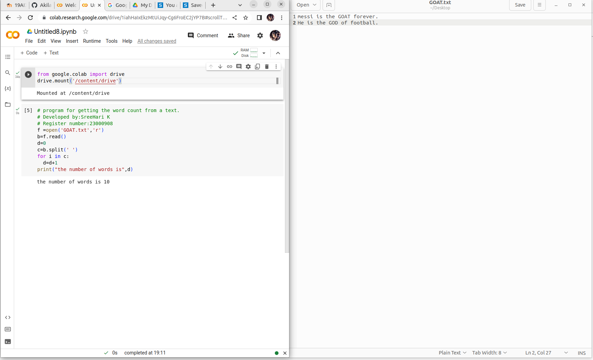

# Word-count
## AIM:
To write a python program for getting the word count from a text.
## EQUIPEMENT'S REQUIRED: 
PC
Anaconda - Python 3.7
## ALGORITHM: 
### Step 1:
Mount your colab with your drive.

### Step 2: 
Opoen your text file in python code runner.
 
### Step 3: 
Read the file and split the words separately using split().
### Step 4:  
Count the number of words in text file using for loop.
### Step 5: 
End the program.

## PROGRAM:
```python
# program for getting the word count from a text.
# Developed by:SreeHari K
# Register number:23000908
from google.colab import drive
drive.mount('/content/drive')

f =open('GOAT.txt','r')
b=f.read()
d=0
c=b.split(' ')
for i in c:
  d=d+1
print("the number of words is",d)  
```

### OUTPUT:



## RESULT:
Thus the program is written to find the word count from a text.
